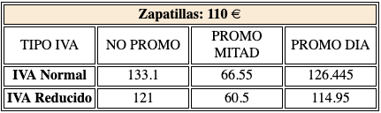

# Conociendo el Lenguaje Php (II)

#### Actividad 1

Realiza un conversor de GB a Kb. La cantidad que se quiere convertir deberá estar almacenada en una variable.

#### Actividad 2

Realiza un programa que calcule la media de cuatro temperaturas almacenadas en 3 variales `$t1`, `$t2`, `$t3` y `$t4`.

#### Actividad 3

Escribe un programa en el que se declaren las variables enteras x e y. Asígnale los valores 144 y 999 respectivamente.
A continuación, muestra por pantalla el valor de cada variable, la suma, el resto, la divisioń y la multiplicación.
Cada operación irá en un párrafo distinto.     Ejemplo: 
<strong>Operación Suma: </strong> resultado 

<strong>Operación Resta: </strong> .... 

etc 

 
#### Actividad 4

Escriba un programa que cada vez que se ejecute muestre un línea de longitud entre 10 y 1000 píxeles, al azar.
Utiliza la función [mt_rand()](https://www.php.net/manual/es/function.mt-rand.php).
Tendrás que hacer uso de la etiqueta 'svg' y dentro de ella de la etiqueta 'line'. Si no la conoces
busca información sobre ella.

#### Actividad 5

Partiendo de 2 variables `$primera` y `$segunda` con valores 10 y 2 , respectivamente, hacer una página PHP que calcule:
1. La diferencia de `$primera` menos `$segunda`.
2. La división de `$primera` entre `$segunda`.

#### Actividad 6

Se pide realizar un generador para una apuesta del juego de Euromillones que nos permita obtener al azar cinco números
principales (del 1 al 50) y dos números (del 1 al 9) llamados “estrellas”.
Las estrellas las pintaremos en rojo mientras que los números en verde.

#### Actividad 7

Escriba un programa que cada vez que se ejecute muestre un círculo de 50px de radio y de un color elegido al azar.
Tendrás que hacer uso de la etiqueta 'svg' y dentro de ella de la etiqueta 'circle'. Si no la conoces
busca información sobre ella.

#### Actividad 8

Escribe un script que calcule el precio final de una zapatillas según su base imponible (precio antes de impuestos), 
teniendo en cuenta que el tipo de IVA aplicable es: 
 - General: 21%
 - Reducido: 10%
 
 Los clientes pueden disfrutar de las siguientes promociones:
 - PROMO_MITAD: 50%
 - PROMO_DIA: 5%;
 
 Muestra en una tabla los diferentes precios que se pueden tener de un producto 
 a partir de las combinaciones de IVA y promociones.

**Nota:** El tipo de IVA y los códigos promocionales deberán ser declarados como constantes `define` ó `const`.
El precio de las zapatillas se almacenará en una variable `precio`.

La siguiente imagen muestra el resultado que queremos obtener:

